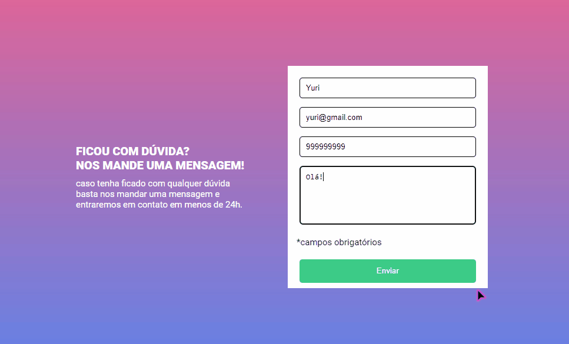
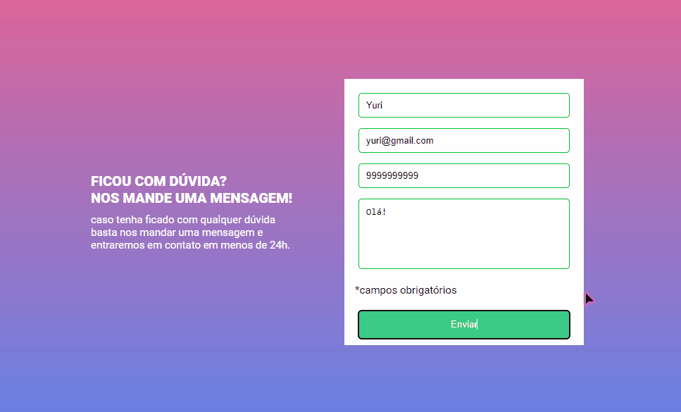
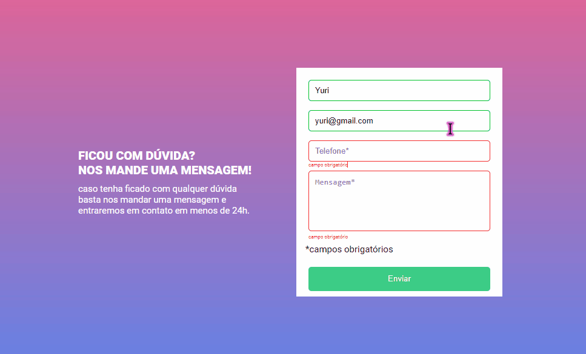

# Huddle Landing Page
Project of a form with JS validation made for a QUEST of the DevQuest course.

## Technologies Used
 
  

### <a href="https://yuriown.github.io/Form-With-Validation-DevQuest/">Click here<a> to access the live project.